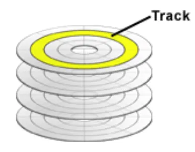
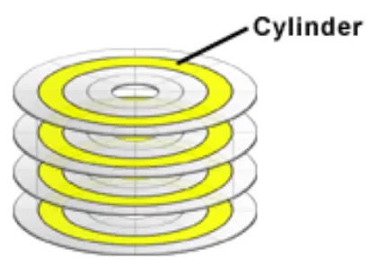

# Divisão de disco 

## Pratos
discos magnéticos no hd que armazena os dados
Cada prato tem duas superfícies que armazenam dados

## Superfície
Cada lado do prato
Cada superfície tem um cabeçote para ler/escrever com precisão

## Setor
Menor unidade de leitura e armazenamento, 512 Bytes em discos antigos (4096B em discos modernos - 4KiB)
Setores começam de 1 até 63

## Cabeçote (head)
Cada Superfície  tem um cabeçote

## Trilha (track)
Círculo com centros iguais em cada superfície
Uma trilha é dividida em setores

## Cilíndro (Cylinder)
Trilhas alinhadas verticalmente  em todos os pratos. Se o cabeçote de cada superfície estiver na trilha 100, o cilíndro 100 é formado

